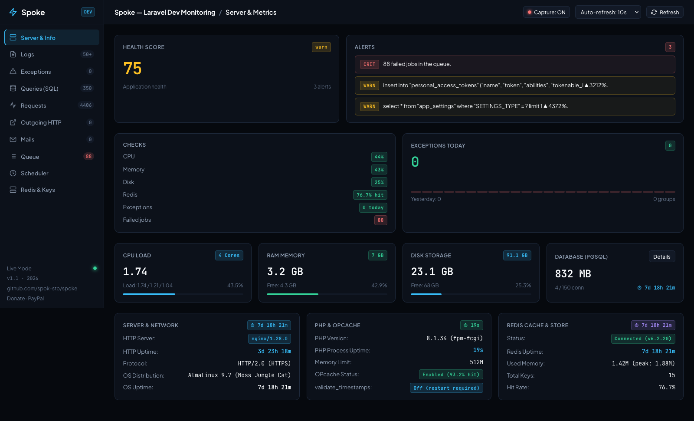

# Spoke

<p align="center">
  <strong>One request. One trace. No telemetry database.</strong>
</p>

<p align="center">
  Self-hosted Laravel monitoring and observability with Flight Recorder tracing,<br>
  SQL intelligence, exception grouping, queue history, outgoing HTTP inspection,<br>
  Redis tooling, server health, and production-aware payload capture.
</p>

<p align="center">
  <a href="https://github.com/spok-sto/spoke">
    
  </a>
  
  
  
  
  <a href="LICENSE.md">
    
  </a>
</p>

<p align="center">
  <a href="#-quick-start"><strong>Quick start</strong></a>
  ·
  <a href="#-why-spoke"><strong>Why Spoke?</strong></a>
  ·
  <a href="#-security"><strong>Security</strong></a>
  ·
  <a href="#-support-spoke"><strong>Support development</strong></a>
</p>

<p align="center">
  <a href="docs/spoke.png">
    
  </a>
</p>

---

## ✨ What is Spoke?

Spoke is a lightweight, self-hosted **Laravel monitoring and observability dashboard** for teams
that want deep framework visibility without adding telemetry tables to their application database
or sending application data to a managed SaaS platform.

Spoke helps answer the question that usually takes the longest:

> **What actually happened during this request?**

Every recorded request receives a `trace_id`. Spoke correlates its SQL queries, Redis commands,
outgoing HTTP calls, queue jobs, exceptions, runtime, and PHP memory into a single
**Flight Recorder** timeline.

Telemetry is appended to daily `.jsonl` files under `storage/logs/spoke/`. When Spoke is disabled,
it registers no dashboard routes or telemetry listeners.

## 🚀 Highlights

| | Capability | What you get |
|---|---|---|
| 🔗 | **Flight Recorder** | One correlated timeline for the complete Laravel request lifecycle |
| 🐘 | **SQL Intelligence** | Slow queries, N+1 detection, fingerprints, rankings, regressions, `EXPLAIN` / `ANALYZE` |
| 💥 | **Exception Center** | Stable grouping, occurrences, affected routes, stack traces, request correlation |
| 🌐 | **HTTP Observability** | Incoming requests and Laravel HTTP client calls with timing and redacted bodies |
| ⚙️ | **Queue History** | Pending, queued, processed, and failed jobs with wait/runtime analytics |
| 🔴 | **Redis Tools** | Command recording, memory statistics, safe `SCAN` explorer, type-aware inspection |
| ✉️ | **Mail Inspector** | Recipients, subjects, and sandboxed HTML previews |
| 📅 | **Scheduler & Commands** | Finished/failed scheduled tasks and optional Artisan command recording |
| 🖥️ | **Server Health** | CPU, RAM, disk, database, Redis, PHP-FPM, OPcache, alerts, and health score |
| 🔒 | **Timed Capture** | Temporarily capture full redacted request/outgoing HTTP payloads with automatic expiry |

## 🎯 Why Spoke?

Spoke occupies a different space from Laravel's established observability tools:

| | Spoke | Laravel Telescope | Laravel Nightwatch |
|---|---|---|---|
| Operating model | Self-hosted dashboard | First-party debugging assistant | Fully managed monitoring platform |
| Telemetry storage | Daily JSONL files | Application database | Hosted Nightwatch platform |
| App DB migrations | **No** | Yes | No telemetry tables in the app |
| Telemetry leaves your server | **No** | No | Yes, after agent-side processing/redaction |
| Primary fit | Self-hosted diagnostics without a telemetry DB | Deep local Laravel debugging | Managed production monitoring |
| Request correlation | Flight Recorder | Entries and watchers | Hosted request insights |
| Cost model | Free personal use; donation-based commercial license | Open source | Hosted service |

Spoke is not presented as a universal replacement:

- Choose **Laravel Telescope** for Laravel's official local debugging workflow and database-backed history.
- Choose **Laravel Nightwatch** for fully managed production monitoring, hosted retention, and SaaS operations.
- Choose **Spoke** when you want Laravel-native diagnostics, self-hosted data, JSONL storage, and no telemetry migrations.

### Main Laravel monitoring tools

- [Laravel Telescope](https://github.com/laravel/telescope) — detailed local debugging.
- [Laravel Pulse](https://github.com/laravel/pulse) — aggregated, self-hosted application metrics.
- [Laravel Nightwatch](https://nightwatch.laravel.com) — managed production observability.
- [Laravel Horizon](https://github.com/laravel/horizon) — Redis queue monitoring and management.
- [Laravel Debugbar](https://github.com/barryvdh/laravel-debugbar) — in-browser local request profiling.

## ⚡ Quick start

### Requirements

| Laravel | PHP |
|---|---:|
| 9.52+ | 8.1+ |
| 10.x | 8.1+ |
| 11.x | 8.2+ |
| 12.x | 8.2+ |
| 13.x | 8.3+ |

Supported database engines: **PostgreSQL** and **MySQL/MariaDB**.  
Queue inspection supports Laravel's **database** and **Redis** queue transports.

### Install from GitHub

```bash
composer config repositories.spoke vcs https://github.com/spok-sto/spoke
composer require konekt/spoke:dev-main
```

Laravel discovers `SpokeServiceProvider` automatically.

<details>
<summary><strong>Install from a local path repository</strong></summary>

Add the package repository to your application's `composer.json`:

```json
{
    "repositories": [
        {
            "type": "path",
            "url": "./packages/konekt/spoke"
        }
    ]
}
```

Then install it:

```bash
composer require konekt/spoke:dev-main
```

</details>

### Enable and secure the dashboard

```env
SPOKE_ENABLED=true
SPOKE_AUTH_ENABLED=true
SPOKE_AUTH_USER=spoke-admin
SPOKE_AUTH_PASS=use-a-long-random-password
SPOKE_ALLOWED_IPS=127.0.0.1,::1
```

Open:

```text
https://your-app.test/spoke
```

> Spoke is disabled by default. Never expose the dashboard publicly with default credentials or an
> unrestricted IP allowlist.

### Publish the configuration

```bash
php artisan vendor:publish --tag=spoke-config
```

The complete configuration reference is available in [`config/spoke.php`](config/spoke.php).

## 🔗 Flight Recorder

Flight Recorder turns fragmented telemetry into one request story:

```text
Request
 ├── SQL queries and N+1 groups
 ├── Redis commands
 ├── Outgoing HTTP calls
 ├── Dispatched and processed queue jobs
 ├── Logged exceptions
 └── Runtime and PHP worker memory
```

Slow events are written immediately so useful diagnostics survive even if the request fails before
Laravel reaches the normal request-finished event.

`TraceContext` is request-scoped and Octane-safe. Queue payload hooks carry `spoke_trace_id` and
queue timing metadata so background job events can rejoin the original request trace.

## 🧠 SQL and Laravel performance monitoring

Spoke records and analyzes the SQL activity that matters:

- configurable slow-query threshold (default: `50 ms`);
- automatic SQL normalization and stable fingerprints;
- possible N+1 detection with affected request context;
- ranking by count, total time, average time, and maximum time;
- regression detection against previous retained days;
- PostgreSQL/MySQL `EXPLAIN`;
- guarded PostgreSQL `EXPLAIN ANALYZE` for `SELECT` / `WITH` statements;
- query health indicators for sequential scans, index use, rows, and cost;
- truncated bindings to protect memory and telemetry size.

## 🌐 Requests, outgoing HTTP, and payload capture

Normal operation favors low overhead and data minimization:

- incoming request payloads are off by default;
- failed request bodies can be enabled separately and are redacted/truncated;
- outgoing HTTP calls persist only when slow or failed by default;
- sensitive headers and JSON/form keys are redacted before data is written;
- successful requests can be sampled while errors are always retained.

The **Capture** button enables temporary deep diagnostics:

- captures incoming request and outgoing HTTP request/response bodies;
- writes full payloads to a separate `capture-YYYY-MM-DD.jsonl` file;
- keeps normal `requests-*` and `http-*` files small and fast;
- continues to redact passwords, tokens, API keys, card data, and configured sensitive keys;
- limits each body to `256 KB` by default;
- automatically turns off after `60 minutes`;
- shows captured bodies inside the related Flight Recorder.

Capture is designed for short debugging sessions, not permanent full-body logging.

## 🛡️ Security

Dashboard access is evaluated in this order:

1. **IP allowlist**
2. **HTTP Basic Authentication** (when enabled)
3. **Laravel `viewSpoke` Gate**

A host application may define a stricter gate:

```php
use App\Models\User;
use Illuminate\Support\Facades\Gate;

Gate::define('viewSpoke', function (?User $user = null): bool {
    return $user?->role_name === 'superadmin';
});
```

Additional safeguards:

- unauthorized IPs and denied Gate requests receive `404` to reduce route enumeration;
- mutating dashboard endpoints use Laravel CSRF protection;
- log/mail readers enforce path boundaries;
- email HTML previews run in a sandbox with restrictive CSP;
- Redis browsing uses `SCAN`, never blocking `KEYS`;
- telemetry is stored outside the public web root;
- recorders fail silently and never break the host request or background job.

For Nginx with PHP-FPM, forward the authorization header:

```nginx
fastcgi_param HTTP_AUTHORIZATION $http_authorization;
```

## ⚙️ Configuration

Common environment variables:

| Variable | Default | Purpose |
|---|---:|---|
| `SPOKE_ENABLED` | `false` | Master switch |
| `SPOKE_PATH` | `spoke` | Dashboard URI |
| `SPOKE_AUTH_ENABLED` | `true` | Require HTTP Basic Auth |
| `SPOKE_AUTH_USER` | `spoke` | Basic Auth username |
| `SPOKE_AUTH_PASS` | `spoke` | Basic Auth password — change before use |
| `SPOKE_ALLOWED_IPS` | `0.0.0.0/0` | Comma/space-separated IPs and CIDRs |
| `SPOKE_RETENTION_DAYS` | `7` | JSONL and mail-preview retention |
| `SPOKE_REQUESTS_SAMPLE_RATE` | `1.0` | Fraction of successful requests retained |
| `SPOKE_QUERIES_SLOW_ONLY_MS` | `50` | Slow SQL threshold |
| `SPOKE_REDIS_SLOW_ONLY_MS` | `5` | Slow Redis threshold |
| `SPOKE_HTTP_SLOW_ONLY_MS` | `200` | Slow outgoing HTTP threshold |
| `SPOKE_RECORD_REQUEST_BODY` | `false` | Store redacted failed-request bodies |
| `SPOKE_CAPTURE_TTL_MINUTES` | `60` | Automatic Capture expiry |
| `SPOKE_CAPTURE_MAX_BODY_BYTES` | `262144` | Capture body limit |
| `SPOKE_RECORD_COMMANDS` | `false` | Optional Artisan command recording |
| `SPOKE_RECORD_CLI` | `false` | Optional SQL recording for CLI/workers |

Use [`config/spoke.php`](config/spoke.php) for recorder switches, redaction keys, reader limits,
health thresholds, regression settings, mail storage, and Redis value limits.

## 📦 Storage, retention, and performance

Spoke uses append-only daily files:

```text
storage/logs/spoke/
├── requests-2026-08-15.jsonl
├── queries-2026-08-15.jsonl
├── exceptions-2026-08-15.jsonl
├── http-2026-08-15.jsonl
├── jobs-2026-08-15.jsonl
├── redis-2026-08-15.jsonl
├── scheduler-2026-08-15.jsonl
├── commands-2026-08-15.jsonl
├── capture-2026-08-15.jsonl
└── mails/
```

Performance-focused behavior:

- `LOCK_EX` append writes instead of database inserts;
- tail-based readers with bounded scan/output sizes;
- no full-file loading for large Laravel logs;
- byte-cursor pagination for multi-gigabyte log files;
- slow/error/N+1 persistence instead of recording every event by default;
- separate capture storage to avoid bloating normal request/HTTP files;
- configurable sampling and body limits;
- seven-day retention by default.

Pruning runs lazily on the first write in a process and can be scheduled independently:

```bash
php artisan spoke:prune
php artisan spoke:prune --days=3
```

Schedule it daily in your Laravel console scheduler:

```php
$schedule->command('spoke:prune')->daily();
```

## ❓ Frequently asked questions

### Is Spoke an alternative to Laravel Telescope?

Spoke is a self-hosted Laravel Telescope alternative for teams that specifically want JSONL
telemetry and no monitoring tables in the application database. Telescope remains Laravel's official
debugging assistant and covers a broader first-party watcher ecosystem.

### Does Spoke replace Laravel Nightwatch?

Not in every use case. Nightwatch is a managed Laravel application monitoring service. Spoke is for
teams that prefer self-hosted Laravel observability and want telemetry to remain on their own server.

### Does Spoke require a database?

No telemetry database is required. Spoke stores its monitoring data in daily JSONL files. It may read
your configured database and queue infrastructure to report diagnostics, but it does not create Spoke
telemetry tables.

### Can Spoke be used in production?

Yes, with deliberate configuration: strong credentials, a restrictive IP allowlist, a host-defined
Gate, sampling, slow-only thresholds, short retention, and temporary payload capture. Spoke is disabled
by default so each application explicitly opts in.

### Does Spoke record passwords or API tokens?

Spoke redacts configured sensitive headers and JSON/form keys before writing payload data. Request
bodies are off by default, and full capture is temporary. Review `redact_keys` for your domain-specific
secrets before enabling body capture.

### How long does Spoke keep telemetry?

The default retention is seven days. Change it with `SPOKE_RETENTION_DAYS` or run
`php artisan spoke:prune --days=N`.

### What are the main Laravel monitoring tools?

The main Laravel tools are Telescope for local debugging, Pulse for aggregated self-hosted metrics,
Nightwatch for managed production observability, Horizon for Redis queues, and Debugbar for local
request profiling.

## 💬 Feedback and roadmap

Spoke is shaped by real Laravel debugging and operations work. If you use it, your experience is
valuable:

- Which trace detail saved you the most time?
- What is still difficult to diagnose?
- Which Laravel integration should Spoke cover next?
- Where does Spoke create too much overhead or noise?

Share feedback through [GitHub Issues](https://github.com/spok-sto/spoke/issues). Clear bug reports,
performance measurements, and real workflow examples directly influence the roadmap.

## 💙 Support Spoke

Spoke is independently developed and maintained. Keeping it compatible across Laravel releases,
improving performance, hardening sensitive-data handling, and building new observability features
requires ongoing engineering time.

If Spoke saves you debugging time or supports your production workflow, please consider making a
donation. Your support helps fund:

- Laravel and PHP compatibility updates;
- performance profiling and optimization;
- security and privacy improvements;
- documentation and usability work;
- new Flight Recorder and monitoring capabilities.

Feedback is always welcome, and donations are never required for personal or non-commercial use.

<p align="center">
  <a href="https://paypal.me/spoke26">
    
  </a>
</p>

> **Commercial use:** A donation of any amount through
> [PayPal](https://paypal.me/spoke26) grants the donor a commercial license. Keep the payment receipt
> as proof of license.

## 📄 License

- **Personal, educational, hobby, and non-commercial use:** free.
- **Commercial and business use:** requires a commercial license.
- **Commercial license:** granted with any donation through
  [paypal.me/spoke26](https://paypal.me/spoke26).

See [LICENSE.md](LICENSE.md) for the complete terms.

---

<p align="center">
  Built for Laravel teams who want to understand every request while keeping observability data under their control.
</p>

<p align="center">
  <a href="https://github.com/spok-sto/spoke">GitHub</a>
  ·
  <a href="https://github.com/spok-sto/spoke/issues">Feedback</a>
  ·
  <a href="https://paypal.me/spoke26">Donate</a>
</p>
